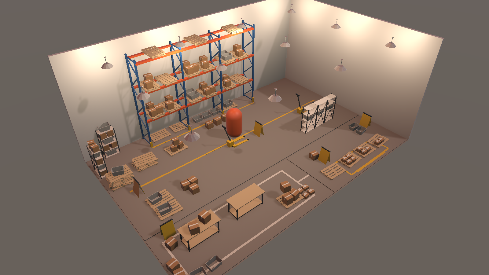

# Fabrik

Fabrik is an experimental factory digital-twin sandbox in Unity. It starts with a visual warehouse representation and a controllable worker proxy, then leaves room for packages, routes, sensors, and machine state. It is not yet connected to a physical facility, PLC, SCADA system, or live telemetry, so it should not be treated as an operational digital twin.

## Project setup

Open the repository root in Unity Hub with Unity Editor **6000.6.3f1** (Apple Silicon). Fabrik uses Universal Render Pipeline (URP).

The warehouse environment comes from the free [Warehouse Pack](https://assetstore.unity.com/packages/3d/environments/warehouse-pack-free-low-poly-warehouse-essentials-407032). In **Window > Package Manager > My Assets**, select Warehouse Pack, then choose **Download** and **Import**. Asset Store source files and the generated Fabrik scene stay local because this repository is public.

After importing, choose **Tools > Fabrik > Create Scene from Warehouse Sample**. This copies the polished sample to `Assets/Scenes/Fabrik.unity`, adds an orange capsule walker, connects the sample's Hero Camera as an over-the-shoulder view, adds stable pushable boxes and shelf physics, and registers the scene for builds. Press **Play**, click the Game view to capture the mouse, and use:

- Mouse: look around.
- `W` / `S` or Up / Down: move forward and backward relative to the camera.
- `A` / `D` or Left / Right: strafe.
- `Escape`: release the mouse; click the Game view to capture it again.
- Play button again: stop the simulation and return to editing.

## Unity scenes and objects

A Unity **scene** is a saved simulation space: its GameObjects, components, lights, cameras, and references to reusable assets. `Fabrik.unity` is the active warehouse scene. The imported vendor sample remains unchanged and can be used to recreate Fabrik.

The **Hierarchy** window lists every GameObject in the open scene. To navigate:

1. Click an object in Hierarchy to select it.
2. Move the pointer over the Scene view and press `F` to frame the selected object.
3. Double-click a Hierarchy object to select and frame it together.
4. Hold the right mouse button and use `WASD` to fly through the Scene view; use the scroll wheel to change speed.
5. Use the Move (`W`), Rotate (`E`), and Scale (`R`) tools to adjust selected objects.

The imported pack provides pallet racks, boltless shelves, totes, pallets, boxes, a pallet jack, packing table, dock door, floor markings, high-bay light, materials, and a complete pick-pack-ship sample scene.
